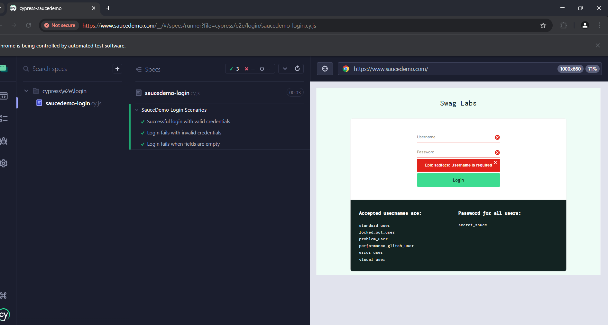

# 🧪 SDET Automation Project – SauceDemo Login Functionality

This is a real-world end-to-end test automation project built with **Cypress**, **Selenium WebDriver**, **Cucumber (BDD)**, and **TestNG**.

🔧 Follows industry-standard best practices like **Page Object Model**, **Pomodoro-based GitHub workflow**, and **modular structure**.

---

## 🗂 Project Structure

```
cypress-saucedemo/
├── cypress/
│   ├── e2e/
│   │   └── login/
│   │       └── saucedemo-login.cy.js
│   ├── fixtures/
│   ├── support/
│   │   ├── commands.js
│   │   └── e2e.js
├── cypress.config.js
├── package.json
└── README.md
```

---

## ✅ Features Covered

- ✅ Successful login using valid credentials.
- ❌ Login should fail with incorrect credentials.
- ❌ Login should fail when username/password are blank.

---

## 🧰 Tech Stack

- **Cypress**
- **JavaScript**
- **Node.js**
- **Mocha + Chai**
- **SauceDemo test app**

---

## 🚀 How to Run

1. **Clone the repo**
```bash
git clone https://github.com/ManishKumar-1972/cypress-saucedemo.git
cd cypress-saucedemo
```

2. **Install dependencies**
```bash
npm install
```

3. **Run Tests via Cypress**
```bash
npx cypress open
```

## 📸 Test Run Screenshot




---

## 🧪 Sample Test Scenarios

```gherkin
Feature: SauceDemo Login Scenarios

Scenario: Successful login with valid credentials
  Given I visit the SauceDemo login page
  When I enter username "standard_user"
  And I enter password "secret_sauce"
  And I click the login button
  Then I should be redirected to the inventory page

Scenario: Login fails with invalid credentials
  When I enter username "invalid_user" and password "wrong123"
  Then I should see an error message

Scenario: Login fails when fields are empty
  When I leave username and password blank
  Then I should see a required field validation message
```

---

## 📊 Reporting

- Visual test results from Cypress GUI.
- Can integrate with Mochawesome or Allure for HTML reports (future update).

---

## 🙋‍♂️ Author

**Manish Kumar**  
💼 SDET | Java | Selenium | Cypress | BDD | TestNG  
🔗 [GitHub Profile](https://github.com/ManishKumar-1972)

---

